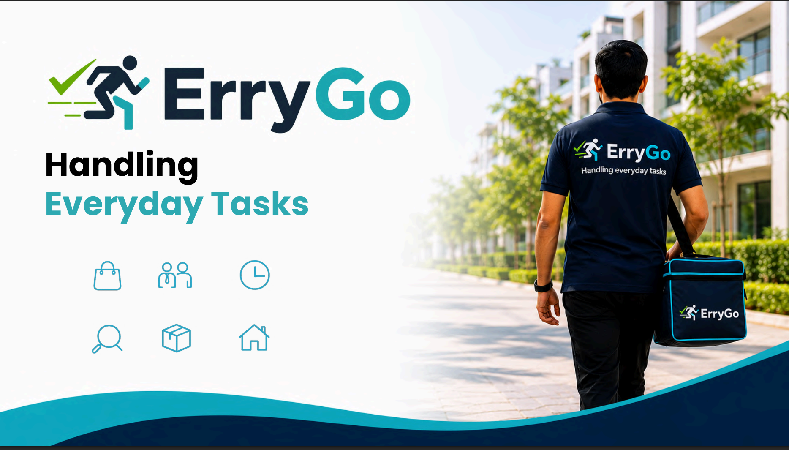
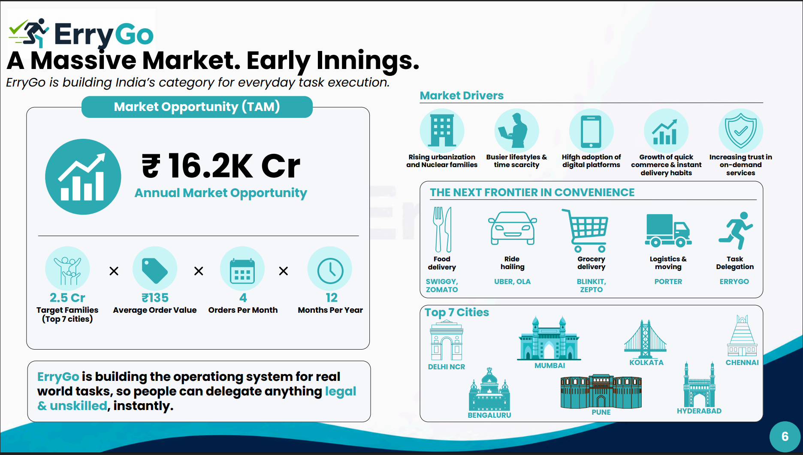
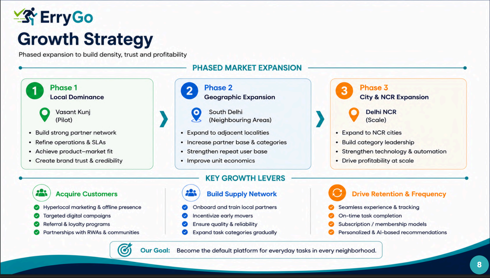
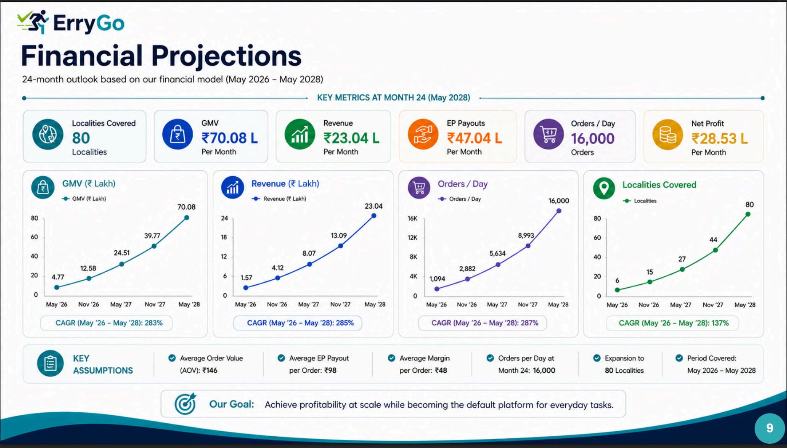
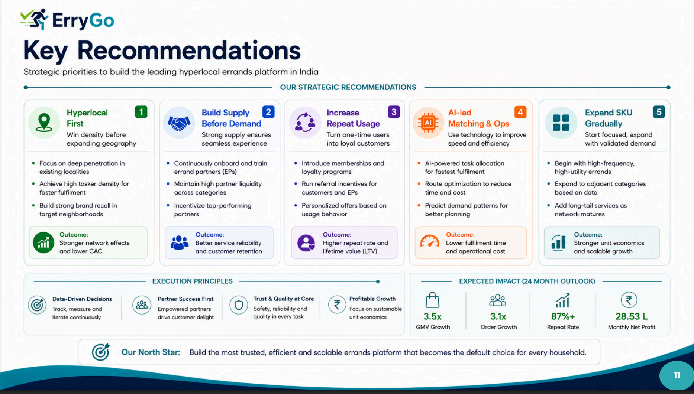

  

# ErryGo - Hyperlocal Marketplace Growth Strategy & Financial Model

A consulting-style strategy project covering market research, financial modelling, GTM strategy, and business planning for an AI-powered hyperlocal marketplace.

## Project Overview

ErryGo is an AI-powered hyperlocal errands marketplace designed to connect customers with trusted local service partners for everyday legal and unskilled tasks.

This project presents a consulting-style business strategy covering market opportunity, competitive benchmarking, business model design, go-to-market strategy, financial modelling, and long-term growth recommendations.

## Deliverables

### 📄 Strategy Deck

**[⬇️ Download the Full Strategy Deck](assets/Hyperlocal_Marketplace_Growth_Strategy.pdf)**

> **Note:** GitHub's built-in PDF preview may not render Canva-designed presentations correctly. Please download the PDF for the best viewing experience.

### 📊 Financial Model

**[Open Financial Model](assets/Financial_Modelling.xlsx)**

### 📚 Research Sources

**[Open Research Sources](assets/Deck_Sources.xlsx)**

## Skills Demonstrated

- Market Research
- Business Strategy
- Financial Modelling
- Competitive Benchmarking
- TAM / Market Sizing
- Go-to-Market (GTM) Strategy
- Unit Economics
- Business Storytelling

## Key Outcomes

- Estimated a **₹16.2K Cr Total Addressable Market (TAM)** across the top 7 Indian cities.
- Built a **24-month financial model** forecasting GMV, revenue, profitability, and expansion.
- Designed a phased **Go-to-Market (GTM) strategy** for scaling across 80 localities.
- Developed marketplace **unit economics** and pricing assumptions.
- Benchmarked major players including **Blinkit, Porter, Urban Company, Zepto, and Snabbit**.
- Identified strategic growth opportunities, operational risks, and recommendations for sustainable expansion.

## Project Preview

### Cover

### Market Opportunity

### Growth Strategy

### Financial Projections

### Strategic Recommendations

## Author

**Vaibhav Mishra**

B.Tech Electrical Engineering  
Delhi Technological University (DTU)

GitHub: https://github.com/vaibhavmishra06

LinkedIn: https://www.linkedin.com/in/vaibhavmishradtu/
